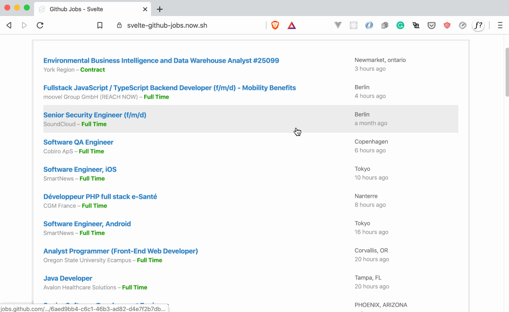

# Github Jobs

This repository contains a frontend web application that re-implements Github's jobs page using [Svelte](https://svelte.dev/).

## Why

It was a practical way to test Svelt in a project that is not exactly a todo list app.

This project covers the following techniques:

* Web components
* Life-cycle hooks
* Asynchronous operations with `async/await` and `Promises`
* Custom events

## How to run it

The quickest way to see this project running is by clicking here: [https://svelte-github-jobs.now.sh](https://svelte-github-jobs.now.sh)

To run on your computer, make sure you have at least Nodejs v12.14.0 and then follow the steps below:

1 - Clone this repository to your machine:

    git clone git@github.com:flowck/svelte-github-jobs.git

2 - Navigate to the project folder: 

    cd svelte-github-jobs

3 - Install the dependencies

    npm install

4 - Run the Github API proxy

    npm run server

5 - Run the frontend app

    npm run dev

## License

MIT

